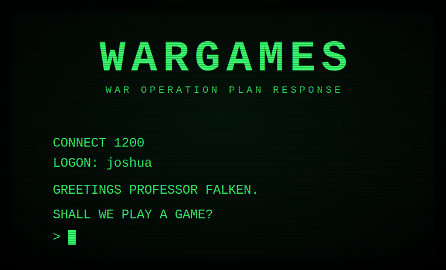
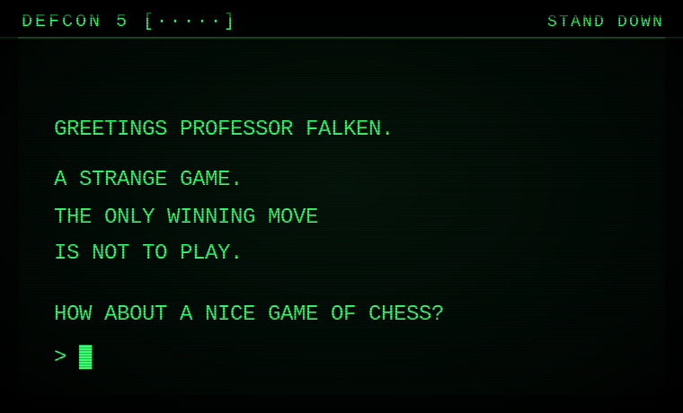

# WarGames: Shall We Play A Game?

An interactive recreation of the 1983 film *WarGames*, played entirely in a retro green-phosphor CRT terminal in your browser. You are David Lightman: a bored teenager with a modem who dials into the wrong computer and nearly starts World War III. The only way out is to teach the machine the lesson it was never given.

**▶ Play: https://azjester.github.io/WarGames-/**

<p align="center">
  
  
</p>

## Run it yourself

No build, no install, no dependencies. Open `index.html` in any modern browser, or serve the folder:

```sh
git clone https://github.com/AzJester/WarGames-.git
cd WarGames-
python3 -m http.server 8000
# then visit http://localhost:8000
```

## How it plays

1. **War dialing.** `SCAN` the Sunnyvale exchange. Most numbers are banks, an airline, a dentist's machine; Protovision's line is dead. One answers with a carrier and no name. `DIAL` it.
2. **The backdoor.** The system is locked, and its games have odd names (FALKEN'S MAZE). `RESEARCH FALKEN`, follow the trail to his son, and log on as `JOSHUA`.
3. **The games.** Seven are playable: tic-tac-toe, chess (casual WOPR rules: the game ends when a king falls), checkers, black jack, five-card-draw poker, Falken's Maze, and Global Thermonuclear War with the big board.
4. **The crisis.** Play the war to the end and the machine doesn't stop. How you handle the NORAD interrogation sets how much they trust you; that trust is the time you get at DEFCON 1 while WOPR brute-forces the launch code character by character on the status bar. Escape the infirmary (the door code is hiding in something you already know), find Falken, and teach Joshua the only lesson he's missing: type `TIC-TAC-TOE` and make it play itself.

Three endings, including a quiet one for the player who refuses to launch and can say why. Type `STATS` for your record and endings found; finish the story once and `MENU` at boot jumps anywhere. Impatient? `SKIP` the first two acts at the title; the logon hints still guide you in.

## Controls

- Type and press Enter. Any key or tap skips the typewriter (and the animations).
- Up/Down arrows recall input history. Escape clears the line.
- `SOUND OFF` / `SOUND ON` toggle audio (on by default). `VOICE OFF` silences Joshua. `FAST` / `SLOW` change text speed.
- `MODE MODERN` (default) renders the big board on canvas with **real coastlines** (Natural Earth data), true city and missile-field coordinates, and **great-circle trajectories** that genuinely cross the Arctic. `VIEW POLAR` switches to the NORAD-wall over-the-pole projection; `VIEW FLAT` is the default world map. `MODE CLASSIC` keeps the ASCII board (also re-rasterized from real geography).
- `DIFFICULTY EASY|NORMAL|HARD` tunes the game AIs and the ABM screens (on easy, interceptors thin the retaliation aimed at you; on hard, yours). Global Thermonuclear War side select includes `3. TWO PLAYERS` for hotseat mutual destruction.
- `LISTEN ON` lets you speak to Joshua (Chrome; uses the browser's speech recognition). `SHARE` after finishing saves a keepsake ending card. The game installs as an app and works offline (PWA).
- `CAPTIONS ON` prints labels for non-speech sound cues. `STATS` shows your record. `MENU` (after finishing once) jumps to any act.
- `SKIP` at the title jumps to the system. `RESET` at the `LOGON:` prompt wipes saved progress.

Stuck? The system's designer had a son. Or type `RESEARCH FALKEN`.

## Accessibility

- All animation (flicker, scanlines, the cursor, the bad-ending flash) is reduced or disabled under `prefers-reduced-motion`.
- Sound is opt-out and persists. Browsers keep audio muted until your first interaction, so the game opens with a "press Enter to power on" gate; that keypress unlocks audio and plays the CRT power-up hum.
- The game is fully keyboard-driven; output is mirrored to an `aria-live` log region for screen readers.

## Development

Plain HTML/CSS/JS, classic scripts, no toolchain. The dialogue, game, intro, crisis, and sound logic are DOM-free and covered by node tests (also run in CI):

```sh
node tests/smoke.js    # Joshua dialogue engine
node tests/games.js    # tic-tac-toe minimax, GTW map and targeting
node tests/games2.js   # chess, checkers, cards, maze, crisis additions
node tests/intro.js    # war-dialer and research archive
node tests/crisis.js   # DEFCON 1 decision logic and endings
node tests/sound.js    # sound module (no-op without WebAudio)
node tests/modern.js   # modern-mode core (dots, arcs, fallback)
node tests/browser.js  # real-browser smoke test (CI; needs playwright)
```

### Layout

```
index.html            boots the terminal
css/crt.css           phosphor theme, scanlines, DEFCON bar, whiteout
js/terminal.js        typewriter output, input, status bar, animation frames
js/sound.js           synthesized modem / klaxon / key clicks (WebAudio)
js/parser.js          shared parsing (game aliases, yes/no)
js/geo.js             baked Natural Earth coastlines + land raster
js/intro.js           Acts 1-2: war-dial pool + research archive
js/wopr.js            Joshua's dialogue engine
js/games/             tic-tac-toe and Global Thermonuclear War
js/crisis.js          Acts 4-5: climax intent + endings
js/engine.js          save/load and the scene runner
js/main.js            scene wiring
```

## Deployment

The site is static; `.github/workflows/pages.yml` publishes the repo root to GitHub Pages on every push to `main`. One-time setup: repo **Settings → Pages → Source: GitHub Actions**. The play link above goes live once that's enabled and this branch is merged.

## Credits

A tribute to *WarGames* (1983), directed by John Badham. Dialogue is adapted, not transcribed. The point stands: the only winning move is not to play.

The text is set in **Glass TTY VT220** by Viacheslav Slavinsky (svofski), the rounded terminal face that matches the film's WOPR displays, vendored in `assets/fonts/`. Box-drawing, block, shade, and marker glyphs were synthesized into it at its own fixed width so the tic-tac-toe and big-board grids stay aligned. A vector build of the **IBM VGA 8x16** CP437 bitmap (bitmap by farsil, CC BY-SA 4.0) ships as a same-width fallback. See `assets/fonts/`.
